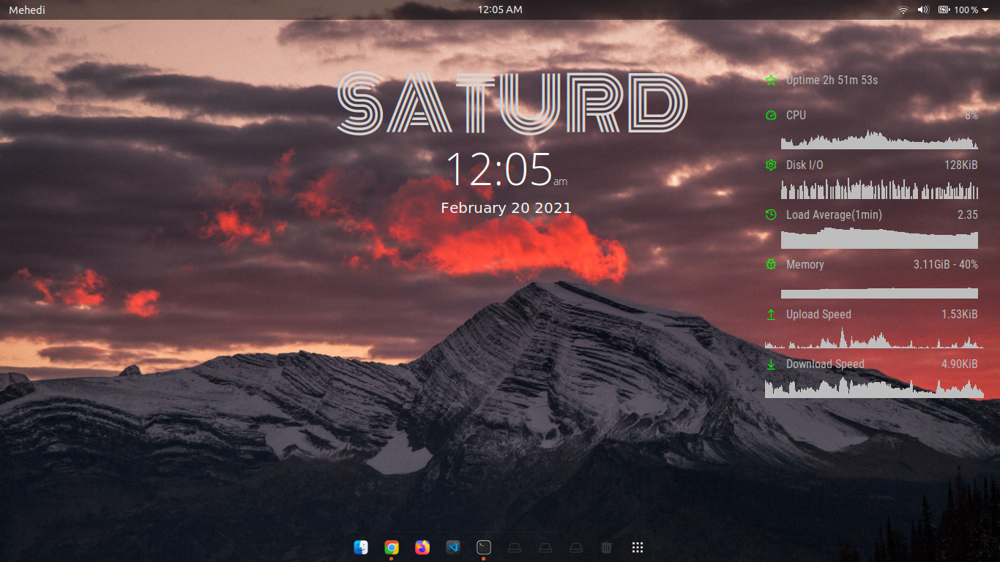

# simple_conky_widets

## Make Sure You Have Conky Manager Install.

Download the <b>zip</b> file .

Extract the <b>zip</b> file .

Go to the extracted Folder <b>OR</b> Directory .

You will find a <b>matrosdz.sh </b> file .

Right click and Open in terminal .

Run the script : <code> ./matrosdz.sh </code>

Now open your conky-manager and you will see the widgets there...

## DEMO:

